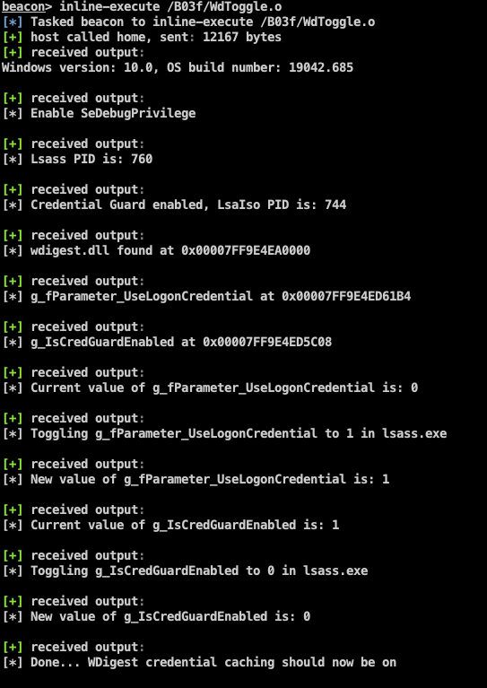

# WdToggle #

A Proof of Concept Cobaltstrike Beacon Object file which uses [direct system calls](https://outflank.nl/blog/2019/06/19/red-team-tactics-combining-direct-system-calls-and-srdi-to-bypass-av-edr/) to enable WDigest credential caching and circumvent **Credential Guard** (if enabled). This PoC code is based on the following excellent blogposts:

[Exploring Mimikatz - Part 1 - WDigest](https://blog.xpnsec.com/exploring-mimikatz-part-1/)

[Bypassing Credential Guard](https://teamhydra.blog/2020/08/25/bypassing-credential-guard/) 

Utilizing direct systems calls using inline assembly provides a more opsec safe way of interacting with the lsass process. Using direct system calls makes sure that AV/EDR software cannot intercept user-mode API calls.

Visual Studio (C++) does not support inline assembly for x64 processors, so in order to write a single Beacon object file containing our compiled / assembled code code we must use the [Mingw-w64](http://mingw-w64.org) (GCC for Windows) compiler.

### What is this repository for? ###

* Demonstrate the usage of direct systems calls using inline-assembly to provide a more opsec safe way of interacting with the lsass process.
* Enable WDigest credential caching by toggling the ``g_fParameter_UseLogonCredential`` global parameter to 1 within the lsass process (wdigest.dll module).
* Circumventing **Credential Guard** (if enabled) by toggling the ``g_IsCredGuardEnabled`` variable to 0 within the lsass process (wdigest.dll module).
* Execute this code within the Beacon process using a [Beacon object file](https://www.cobaltstrike.com/help-beacon-object-files).

### How do I get set up? ###

* Clone this repository.
* Make sure you have the Mingw-w64 compiler installed. On Mac OSX for example, we can use the ports collection to install Mingw-w64 (``sudo port install mingw-w64``).
* Run the ``make`` command to compile the Beacon object file.
* Within a Cobaltstrike beacon context run the ``inline-execute`` command and provide the path to the object ``WdToggle.o`` file.
* Run the Cobaltstrike ``logonpasswords`` command (Mimikatz) and notice that clear text passwords are enabled again for new user logins or users who **unlock** their desktop session.

   

### Limitations ###

* This memory patch is not reboot persistent, so after a reboot you must rerun the code.
* The memory offset to the ``wdigest!g_fParameter_UseLogonCredential`` and ``wdigest!g_IsCredGuardEnabled`` global variable could change between Windows versions and revisions. We provided some offsets for different builds, but these can change in future releases. You can add your own version offsets which can be found using the Windows debugger tools.

```
C:\Program Files (x86)\Windows Kits\10\Debuggers\x64>cdb.exe -z C:\Windows\System32\wdigest.dll

0:000>x wdigest!g_fParameter_UseLogonCredential
00000001`800361b4 wdigest!g_fParameter_UseLogonCredential = <no type information>
0:000> x wdigest!g_IsCredGuardEnabled
00000001`80035c08 wdigest!g_IsCredGuardEnabled = <no type information>
0:000>
```

### Detection ###

To detect credential theft through Lsass memory access, we could use a tool like [Sysmon](https://docs.microsoft.com/en-us/sysinternals/downloads/sysmon).
Sysmon can be configured to log processes accessing the lsass.exe process. With this configuration applied we can monitor for suspicious processes accessing the Lsass process and help detecting possible credential dumping activity. Of course, there are more options to detect credential theft, for example using an advanced detection platform like Windows Defender ATP. But if you don’t have the budget and luxury of using these fancy Detection and Response platforms, then Sysmon is that free tool that can help to fill up the gap.

### Credits ###

* The assembly code used within this tool is based on the assembly output from the 
[SysWhispers](https://github.com/jthuraisamy/SysWhispers) tool from [@Jackson_T](https://twitter.com/Jackson_T).
* Adam Chester [@\_xpn\_](https://twitter.com/_xpn_)
* N4kedTurtle from [Team Hydra](https://teamhydra.blog)